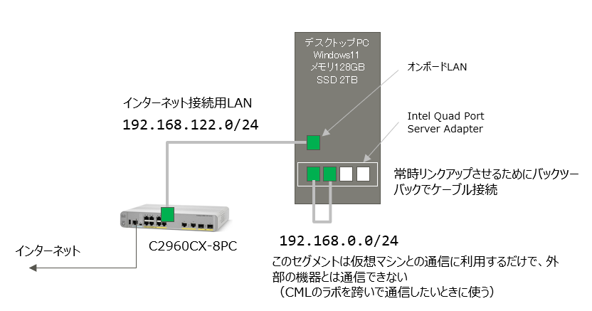
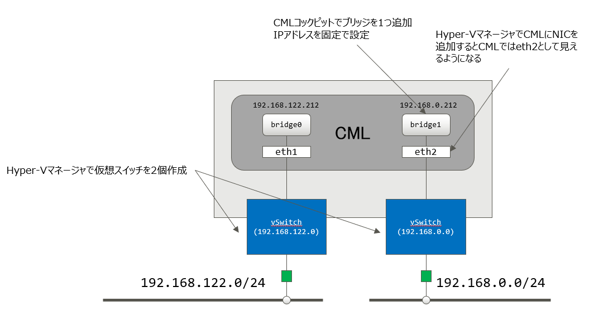
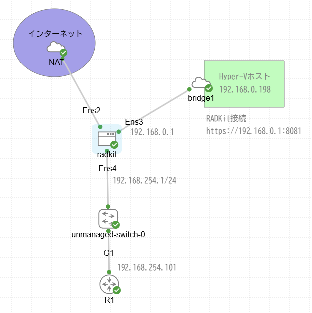
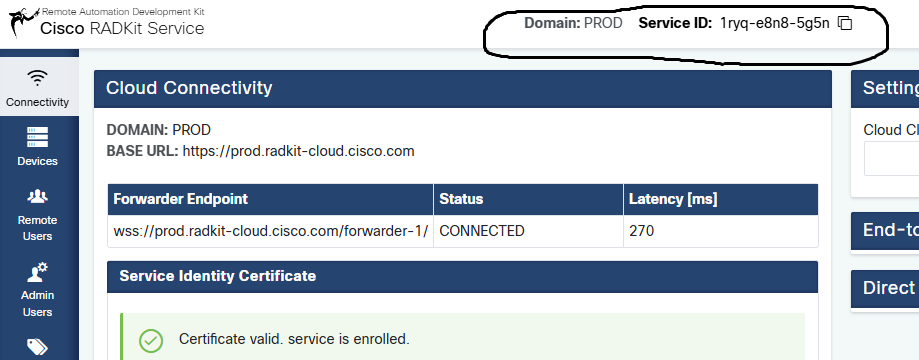

# RADKitをCMLで使うメモ

<br>

## CML環境

Hyper-Vを有効にしたWindows11上でCMLを動かしています。

このWindows11には物理NICが5個あり、そのうち2個を利用しています（常時リンクアップさせるためのポートを含めると合計3ポート使用）。

一つは実際にインターネットに出ていけるLAN、もう一つはリンクアップしているだけの何もつながっていないNICです。

<br>



<br>

利用している2個のNICをCMLとブリッジで繋いでいます。★ここ重要



<br>

CML内のラボ機器に外部のアドレスを割り当てたいときには `bridge0` につなぎます。

外部接続は不要なものの、母艦となるWindowsとは通信したい、という場合には `bridge1` につなぎます。

CML内の異なるラボの機器同士で通信したい、という場合にも `bridge1` を経由すると便利です。

<br><br>

CMLのラボの中にRADKit serviceをインストールするUbuntuを立てます。

ラボの構成はこのような感じです。

<br>



<br>

RADKitのインストーラはシェルスクリプトなので、それをUbuntuに転送しなければいけません。
CMLラボ内のUbuntuからwgetでファイルを落とせるように、どこかに自分で制御できるHTTPサーバを立てておきます。
ここでは母艦になっているWindows11でIISを有効にしておきます。

<br>

## RADKitをダウンロード

母艦になっているWindows11で以下のサイトを開きます。

https://radkit.cisco.com/

画面右上のDownloadsからインストーラのシェルスクリプトをダウンロードします。

<br>

> [!NOTE]
>
> 2024年11月時点での最新 cisco_radkit_1.7.4_linux_x86_64.sh をダウンロードしました。

<br>

これをIISのルートにコピーしておきます。

<br>

## CMLのラボに仮想マシンを作成する

Ubuntuを作成します。

UbuntuはRADKit serviceをインストールするマシンです。

インターネット上のクラウドと通信しますので外部接続が必要です。これはNAT接続を利用します。

RADKit serviceの設定はブラウザを使ったGUI操作になりますので、Ubuntuに対してブラウザで接続できなければいけません。
その経路としてもう一つのNICを使い、母艦になっているWindows11からブラウザでアクセスできるようにします。
母艦のWindows11はこのNICに対して192.168.0.198/24のアドレスを固定で設定していますので、
RADKitのUbuntuには192.168.0.1/24のアドレスを採番します。

RADKit serviceは同時にCMLのラボ機器とも接続します。それ用のLANも必要ですので、合計3本足のマシンになります。

整理すると、

- ens2はNATで外に出ていく通信に使うインタフェース（dhcp）
- ens3は母艦のWindows11とブリッジで接続するインタフェース（192.168.0.1/24）
- ens4はラボ内のネットワーク機器と接続するインタフェース(192.168.254.1/24)

となります。

UbuntuのTagsには `serial:50000` と設定して5000番ポートでシリアルコンソール接続できるようにします。

Ubuntuに以下のYAMLをCONFIGにコピペします。

```yaml
#cloud-config
hostname: radkit
manage_etc_hosts: True
system_info:
  default_user:
    name: root
password: cisco
chpasswd: { expire: False }
ssh_pwauth: True
ssh_authorized_keys:
  - your-ssh-pubkey-line-goes-here
timezone: Asia/Tokyo
locale: ja_JP.utf8
write_files:
  - path: /etc/netplan/50-cloud-init.yaml
    content: |
      network:
        ethernets:
          ens2:
            dhcp4: true
            #nameservers:
            #  addresses:
            #    - 192.168.122.1

          ens3:
            dhcp4: false
            addresses:
              - 192.168.0.1/24
            #gateway4: 192.168.254.1

          ens4:
            dhcp4: false
            addresses:
              - 192.168.254.1/24
            #routes:
            #  - to: 10.0.0.0/8
            #    via: 192.168.254.101

        version: 2

runcmd:
  - sudo netplan apply

  - sudo ufw allow 8081/tcp

  - sudo ufw allow 8181/tcp

  - |
    sudo cat - << 'EOS' >> /root/.bashrc
    rsz () if [[ -t 0 ]]; then local escape r c prompt=$(printf '\e7\e[r\e[999;999H\e[6n\e8'); IFS='[;' read -sd R -p j"$prompt" escape r c; stty cols $c rows $r; fi
    rsz
    EOS

  - |
    sudo cat - << 'EOS' >> /root/.bashrc
    RADKIT_ROOT="/opt/radkit/bin"
    export PATH=$RADKIT_ROOT:$PATH
    EOS

  # - wget -P /tmp 192.168.122.198/cisco_radkit_1.7.4_linux_x86_64.sh

```

<br>

> [!NOTE]
>
> 以下の作業はすべてrootユーザで実行することを前提にしています。

<br>

TeraTERMを起動してCMLのポート5000番にtelnetして、Ubuntuのシリアルコンソールに接続します。

rootでログインします。

<br>

## RADKitをインストールする

wgetでインストーラをダウンロードします。

ここでは母艦のWindows11（192.168.122.198）のIISのサーバルートに置いたファイルをダウンロードしています。

```bash
wget -P /tmp 192.168.122.198/cisco_radkit_1.7.4_linux_x86_64.sh
```

インストールします。

```bash
sh /tmp/cisco_radkit_1.7.4_linux_x86_64.sh
```

システムにインストールするか、ユーザ個別にインストールするか聞かれるので、`system` を選びます。

インストール後に以下のような注意喚起のメッセージが表示されます。

```bash

lq POST-INSTALLATION INSTRUCTIONS qqqqqqqqqqqqqqqqqqqqqqqqqqqqqqqqqqqqqqqqk
x #!/bin/bash                                                             x
x                                                                         x
x # Firewall                                                              x
x # `ufw` detected.                                                       x
x # IF you are using it, please consider these suggested rules:           x
x # - the following port must be opened for WebUI access (recommended)    x
x sudo ufw allow 8081/tcp                                                 x
x # - the following port must be opened for Direct Connect (optional)     x
x sudo ufw allow 8181/tcp                                                 x
x                                                                         x
x                                                                         x
x # Start or restart RADKit service                                       x
x # RADKit is not running.                                                x
x # To start RADKit service, use the following command:                   x
x sudo systemctl start radkit                                             x
x                                                                         x
x                                                                         x
x # Bootstrap RADKit Service using the WebUI:   https://localhost:8081    x
x # or RADKit Control:   /opt/radkit/bin/radkit-control system bootstrap  x
x # (for non-interactive bootstrap, please refer to the documentation)    x
x                                                                         x
x # Enroll and configure RADKit Service using the WebUI or RADKit Control x
x # (for detailed instructions, please refer to the documentation)        x
x                                                                         x
mqqqqqqqqqqqqqqqqqqqqqqqqqqqqqqqqqqqqqqqqqqqqqqqqqqqqqqqqqqqqqqqqqqqqqqqqqj


lq WARNING qqqqqqqqqqqqqqqqqqqqqqqqqqqqqqqqqqqqqqqqqqqqqqqqqqqqqqqqqqqqqqqqqqqqk
x Post installation instructions have been written into                        x
x /opt/radkit/versions/1.7.4/post-install.sh.                                  x
x Please adjust the script to your site policies and run when ready using the  x
x command: sh /opt/radkit/versions/1.7.4/post-install.sh                       x
mqqqqqqqqqqqqqqqqqqqqqqqqqqqqqqqqqqqqqqqqqqqqqqqqqqqqqqqqqqqqqqqqqqqqqqqqqqqqqqj


lq WARNING qqqqqqqqqqqqqqqqqqqqqqqqqqqqqqqqqqqqqqqqqqqqqqqk
x Make sure that /opt/radkit/bin is in your PATH.         x
x To uninstall, run: /opt/radkit/versions/1.7.4/uninstall x
mqqqqqqqqqqqqqqqqqqqqqqqqqqqqqqqqqqqqqqqqqqqqqqqqqqqqqqqqqj

```

これら注意喚起メッセージに素直に従って、次のスクリプトを実行します。

```bash
sh /opt/radkit/versions/1.7.4/post-install.sh
```

サービスの起動状況を確認します。

```bash
systemctl status radkit
```

こんな感じでactiveになっていればOKです。

```bash
root@radkit:~# systemctl status radkit
● radkit.service - RADKit Service
     Loaded: loaded (/etc/systemd/system/radkit.service; enabled; vendor preset>
     Active: active (running) since Sun 2024-11-10 12:07:04 JST; 10min ago
   Main PID: 576 (radkit-service)
      Tasks: 8 (limit: 2310)
     Memory: 293.2M
        CPU: 3.084s
     CGroup: /system.slice/radkit.service
             mq576 /opt/radkit/versions/1.7.4/python/bin/python3 /opt/radkit/bi>
```

Ubuntuに割りあてられているIPアドレスを確認します。

```bash
ip address
```

実行例。

```bash
root@radkit:~# ip address
2: ens2: <BROADCAST,MULTICAST,UP,LOWER_UP> mtu 1500 qdisc fq_codel state UP group default qlen 1000
    link/ether 52:54:00:19:eb:e6 brd ff:ff:ff:ff:ff:ff
    altname enp0s2
    inet 192.168.255.114/24 metric 100 brd 192.168.255.255 scope global dynamic ens2
       valid_lft 3418sec preferred_lft 3418sec
    inet6 fe80::5054:ff:fe19:ebe6/64 scope link
       valid_lft forever preferred_lft forever
3: ens3: <BROADCAST,MULTICAST,UP,LOWER_UP> mtu 1500 qdisc fq_codel state UP group default qlen 1000
    link/ether 52:54:00:02:14:24 brd ff:ff:ff:ff:ff:ff
    altname enp0s3
    inet 192.168.0.1/24 brd 192.168.0.255 scope global ens3
       valid_lft forever preferred_lft forever
    inet6 fe80::5054:ff:fe02:1424/64 scope link
       valid_lft forever preferred_lft forever
4: ens4: <BROADCAST,MULTICAST,UP,LOWER_UP> mtu 1500 qdisc fq_codel state UP group default qlen 1000
    link/ether 52:54:00:00:0f:11 brd ff:ff:ff:ff:ff:ff
    altname enp0s4
    inet 192.168.254.1/24 brd 192.168.254.255 scope global ens4
       valid_lft forever preferred_lft forever
    inet6 fe80::5054:ff:fe00:f11/64 scope link
       valid_lft forever preferred_lft forever
```

ens2の192.168.255.114/24はNATで外部に接続するためのアドレスで、DHCPで割り当てられたものです。DNSやデフォルトルートもこのインタフェースにあります。

ens3の192.168.0.1/24は固定で設定したbridge1のLANのアドレスです。このLAN上を経由して母艦のWindows11に通信できます。

ens4の192.168.254.1/24は固定で設定したもので、ラボ内の機器と接続するためのアドレスです。

RADKitはCiscoのクラウドと通信しますので、インターネットとの接続性を確認します。

```bash
root@radkit:~# ping www.google.co.jp
PING www.google.co.jp (172.217.26.227) 56(84) bytes of data.
64 bytes from bom05s09-in-f3.1e100.net (172.217.26.227): icmp_seq=1 ttl=118 time=6.65 ms
64 bytes from nrt12s51-in-f3.1e100.net (172.217.26.227): icmp_seq=2 ttl=118 time=7.15 ms
64 bytes from bom05s09-in-f3.1e100.net (172.217.26.227): icmp_seq=3 ttl=118 time=9.23 ms
64 bytes from nrt12s51-in-f3.1e100.net (172.217.26.227): icmp_seq=4 ttl=118 time=7.35 ms
64 bytes from nrt12s51-in-f3.1e100.net (172.217.26.227): icmp_seq=5 ttl=118 time=8.24 ms
64 bytes from bom05s09-in-f3.1e100.net (172.217.26.227): icmp_seq=6 ttl=118 time=8.06 ms
^C
--- www.google.co.jp ping statistics ---
6 packets transmitted, 6 received, 0% packet loss, time 5008ms
rtt min/avg/max/mdev = 6.650/7.781/9.232/0.842 ms
```

<BR>

> [!NOTE]
>
> RADKit serviceが接続する宛先は prod.radkit-cloud.cisco.com ですが、pingには応答しませんので、
> どこか適当なサイトにpingしてDNSの機能と通信可否を確認します。

<BR>

外部接続が問題なければ、母艦のWindows11のブラウザからRADKit serviceのURL `https://192.168.0.1:8081` に接続します。

初めて接続すると superadmin のパスワードを設定せよ、と言われますので設定します。

パスワードを設定したら、最初にクラウドと接続してサービスIDを取得します。

画面内の「Enroll with SSO」をクリックします。

CCOに登録したメールアドレスを入力します。

`Follow the SSO login link to continue: [CLICK HERE]` をクリックすると認証が走ります。

Acceptを押します。

もとのページに戻ると、画面の上部に重要な情報が表示されていますので、それをコピペしてどこかに保存しておきます。

> 例： Domain: PROD Service ID: 1ryq-e8n8-5g5n

<br>



<br>

画面左側のRemote Usersから接続許可を払い出すユーザを登録します。最初は自分を登録しておけばいいでしょう。

画面左側のDevicesから装置の情報を登録します。

<BR>

## RADKitクライアントをインストール

RADKitクライアントはインターネットに接続できる端末であればどれでもかまいません。

ここではWindows10のWSL(Ubuntu20.04)に入れます。

```bash
sh cisco_radkit_1.7.4_linux_x86_64.sh
```

customを選択します。

~/.bashrcに以下を追加してPATHを通します。

```bash
## RADKit
RADKIT_ROOT="$HOME/.local/radkit"
export PATH="$RADKIT_ROOT/bin:$PATH"
```

<br>

## RADKitクライアントを削除

やっぱり使わない、という場合に備えて削除方法も確認しておきます。

インストールしたときに削除方法が表示されていますので、それに従ってuninstallを走らせます。

```bash
┌─ WARNING ────────────────────────────────────────────────────────────┐
│ Make sure that /home/iida/.local/radkit/bin is in your PATH.         │
│ To uninstall, run: /home/iida/.local/radkit/versions/1.7.4/uninstall │
└──────────────────────────────────────────────────────────────────────┘
```

<br>

## クライアントの使い方

使い方はいくつかパターンがあります。

1. radkit-interactive 機器にログインしてCLIで操作する（その都度、表示されるリンクにアクセスしてクラウド上で認証が必要）

2. radkit-client Emacs風のシェルで操作

3. radkit-network-console 機器へのログインとCLI操作


<br>

### radkit-interactive

あらかじめRADKit service側で接続許可を出しておきます。

特定のラボ機器に直接ログインする場合には次のようにします。

```bash
$ radkit-interactive --domain PROD --service-sn 1ryq-e8n8-5g5n --sso-email iida@fujitsu.com --device r1
```

--domainと--service-snは先程コピペしておいた情報です。

--sso-emailは接続許可を出した人のメールアドレス（CCOアカウント）

--deviceは装置名

リンクが表示されるので、そのリンクを踏んで認証すると機器に接続できます。

装置への接続は実際にはRADKit serviceが行なっていますので、装置のパスワードを知らなくてもログインできますし、enableパスワードを知らなくてもenable状態になっています。

<br>

### radkit-network-console

乗り込みたい機器が複数ある場合には、radkit-network-consoleを使ったほうが認証の手間が少なくて便利です。

起動すると独特なシェルが走ります。

```bash
radkit-network-console
```

`help` を打ち込むと実行できるコマンドの一覧が表示されます。

```bash
> help

        Prints the list and help strings of available commands.
        Usage:
            help [<action>]

Available actions:
    download
    platform
    session-logs
    login
    logout
    proxy
    reauthenticate
    service
    service-cloud
    service-direct
    service-direct-with-sso
    show
    snmp
    update-inventory
    upload
    help
    interactive
    attach
    port-forward
    pwd
    cd
    python-repl
    exit
    quit
    !
```

`login iida@fujitsu.com` でログインします。

```bash
[] > login iida@fujitsu.com
Logging in as: iida@fujitsu.com on domain PROD

[iida] >
```

認証すると、プロンプトが変わります。

`service` コマンドでサービスにつなぎます。このとき`no-sr`オプションを付けるのを忘れないように。デフォルトはsr付きになっているようです。

```bash
[iida] > service 1ryq-e8n8-5g5n no-sr
Connecting to Service: 1ryq-e8n8-5g5n without SR context

[iida@1ryq-e8n8-5g5n] >
```

サービスに接続するとプロンプトが変わります。

ここまでくれば、RADKit serviceから接続できる全ての機器に（個別認証なしで）インタラクティブに接続できます。

```bash
[iida@1ryq-e8n8-5g5n] > interactive r1

   Attaching to  r1  ...
     Type:  ~.  to detach.
            ~?  for other shortcuts.
   When using nested SSH sessions, add an extra  ~  per level of nesting.

Warning: all sessions are logged. Never type passwords or other secrets, except at an echo-less password prompt.


R1#
R1#exit
detached
Interactive session logs saved in file [/home/iida/.radkit/session_logs/client/20241114-150626170319-r1.log]

[iida@1ryq-e8n8-5g5n] >
```

<br>

### radkit-client

radkit-clientは補完機能が付いたPythonシェルの中で操作します。

Pythonでスクリプトを書きたいんだけど、どんなメソッドがあるのか知りたい人が試しに実行するときに便利です。

シェルを立ち上げるには引数なしで `radkit-client` を実行します。

```bash
Example usage:
    sso_login("<email_address>")                 # Authenticate with SSO
    certificate_login("<email_address>")         # OR authenticate with a certificate
    access_token_login("<access_token>")         # OR authenticate with an SSO Access Token

    service = service_cloud("<serial>")          # Then connect to a RADKit Service
    service = service_integrated()               # Start an integrated session
    service = service_direct(host=..., port=...) # Cloud-less direct connection to service.
    service = service_direct_with_sso(...)       # SSO authenticated cloud-less connection.

    grant_service_otp()                          # Enroll a new service
    cloud_connections                            # List active cloud connections.
```

上記のように例が表示されますので、まずはsso_login()を実行します。

```bash
sso_login("iida@fujitsu.com)
```

リンクが表示されるので、それをクリックします。

ブラウザでログインすると、元の画面には次のように表示されます。

```bash
[CONNECTED] Client(status='CONNECTED')
------------------  ---------------------------------------
default_domain      PROD
default_connection  domain=PROD; client_id=iida@fujitsu.com
connected_domains   PROD
services            not connected to any service
running_proxies     no local proxy running
------------------  ---------------------------------------
```

次にサービスに接続します。

事前にメモしておいたサービス番号を指定して `service = client.service("1ryq-e8n8-5g5n")` を実行します。

```bash
>>> service = client.service("1ryq-e8n8-5g5n")
05:36:18.623Z INFO  | Connecting to forwarder [forwarder_base_url='wss://prod.radkit-cloud.cisco.com/forwarder-2/' uri='wss://prod.radkit-cloud.cisco.com/forwarder-2/websocket/']
05:36:20.128Z INFO  | Connection to forwarder successful [forwarder_base_url='wss://prod.radkit-cloud.cisco.com/forwarder-2/' uri='wss://prod.radkit-cloud.cisco.com/forwarder-2/websocket/']
05:36:20.366Z INFO  | Forwarder client created. [forwarder_base_url='wss://prod.radkit-cloud.cisco.com/forwarder-2/']
05:36:20.804Z INFO  | Connecting to forwarder [forwarder_base_url='wss://prod.radkit-cloud.cisco.com/forwarder-3/' uri='wss://prod.radkit-cloud.cisco.com/forwarder-3/websocket/']
05:36:22.328Z INFO  | Connection to forwarder successful [forwarder_base_url='wss://prod.radkit-cloud.cisco.com/forwarder-3/' uri='wss://prod.radkit-cloud.cisco.com/forwarder-3/websocket/']
05:36:22.567Z INFO  | Forwarder client created. [forwarder_base_url='wss://prod.radkit-cloud.cisco.com/forwarder-3/']
>>>
```

ログインできるデバイスの一覧を調べます。

```bash
>>> service.inventory
[READY] <radkit_client.sync.device.DeviceDict object at 0x7f3f60297b50>
name    host             device_type    Terminal    Netconf    SNMP    Swagger    HTTP    description    failed

------  ---------------  -------------  ----------  ---------  ------  ---------  ------  -------------  --------
r1      192.168.254.101  IOS_XE         True        False      False   False      False                  False
Untouched inventory from service 1ryq-e8n8-5g5n.
```

r1という装置が見えます。

`service.inventory` はPythonの辞書型データなので、r1という装置を取り出します。

```bash
>>> device = service.inventory['r1']
```

取り出したデバイスにインタラクティブに接続します。

```bash
>>> device.interactive()
05:45:18.503Z INFO  | Starting interactive session (will be closed when detached)
05:45:19.515Z INFO  | Session log initialized [filepath='/home/iida/.radkit/session_logs/client/20241114-144518503695-r1.log']

   Attaching to  r1  ...
     Type:  ~.  to terminate.
            ~?  for other shortcuts.
   When using nested SSH sessions, add an extra  ~  per level of nesting.

Warning: all sessions are logged. Never type passwords or other secrets, except at an echo-less password prompt.


R1#
```

セッションログは `[filepath='/home/iida/.radkit/session_logs/client/20241114-144518503695-r1.log']` にある、と表示されています。

RADKitを動かしている端末の `~/.radkit` にログが残ります。

いつの間にか肥大化してディスク容量がいっぱいになったり、セキュリティ上のリスクにならないように、こまめに削除するように心がけたほうが良さそうです。

装置から抜ければ、再びPythonシェルに戻ります。

```bash
R1#exit

05:48:00.451Z INFO  | Interactive session closed
>>>
```

装置に乗り込むまでもなく、単にコマンドを打ち込めればいい、ということなら `device.exec()` が使えます。

exec()は「コマンドを打ち込め」という命令をサービス側に要求するものなので、要求に対する結果が欲しいときは別途、`request.wait()`要求を出します。

```bash
>>> request = device.exec('show ip int brief')
>>> result = request.wait()
>>> result.result.data
'R1#show ip int brief\nInterface              IP-Address      OK? Method Status                Protocol\nGigabitEthernet
1       192.168.254.101 YES NVRAM  up                    up      \nGigabitEthernet2       unassigned      YES NVRAM  adm
inistratively down down    \nGigabitEthernet3       unassigned      YES NVRAM  administratively down down    \nGigabitEt
hernet4       unassigned      YES NVRAM  administratively down down    \nGigabitEthernet5       unassigned      YES NVRA
M  administratively down down    \nGigabitEthernet6       unassigned      YES NVRAM  administratively down down    \nGig
abitEthernet7       unassigned      YES NVRAM  administratively down down    \nGigabitEthernet8       unassigned      YE
S NVRAM  administratively down down    \nR1#'
```

シェルにダンプさせると美しくない結果になりますので、`print()` した方が良さそうです。

```bash
>>> print(result.result.data)
R1#show ip int brief
Interface              IP-Address      OK? Method Status                Protocol
GigabitEthernet1       192.168.254.101 YES NVRAM  up                    up
GigabitEthernet2       unassigned      YES NVRAM  administratively down down
GigabitEthernet3       unassigned      YES NVRAM  administratively down down
GigabitEthernet4       unassigned      YES NVRAM  administratively down down
GigabitEthernet5       unassigned      YES NVRAM  administratively down down
GigabitEthernet6       unassigned      YES NVRAM  administratively down down
GigabitEthernet7       unassigned      YES NVRAM  administratively down down
GigabitEthernet8       unassigned      YES NVRAM  administratively down down
R1#
```

show techのように長い時間かかるコマンドはタイムアウト値を大きくしないと失敗します。

```bash
>>> request = device.exec("show tech", timeout=300)
>>> result = request.wait()
>>> result
[SUCCESS] <radkit_client.sync.request.TransformedFillerRequest object at 0x7fa5305f9110>
--------------------  -------------------------------------------------------------------
sent_timestamp        2024-11-14 15:20:26
request_type          Command execution
client_id             iida@fujitsu.com
service_id            1ryq-e8n8-5g5n
updates               1 total, 1 succeeded, 0 failed
result                AsyncExecSingleCommandResult(command='show tech', status='SUCCESS')
forwarder             wss://prod.radkit-cloud.cisco.com/forwarder-3/
e2ee_used             True
compression_used      zstd
h2_multiplexing_used  True
--------------------  -------------------------------------------------------------------

>>> print(len(result.result.data))
1471235
>>>
```

show techの出力結果は長いので、画面には出さずにファイルに落とした方がいいでしょう。

書き込むファイルは事前にtouchして作成しておかないとエラーになります。

```bash
>>> f = open("/home/iida/show_tech.txt", "w")
>>> for line in result.result.data:
...     f.write(line)
>>> f.close()
```

<br>

## Pythonスクリプトで動かす

自分でPythonスクリプトを書いてRADKitを動かしたい場合、pipでパッケージ（wheels）をインストールします。

ダウンロードページからダウンロードします。

https://radkit.cisco.com/downloads/release/

<br>

> [!NOTE]
>
> 2024年11月時点での最新 cisco_radkit_1.7.4_pip_linux_x86.tgz をダウンロードしました。
> ダウンロードしたファイルはWSLの/tmpとか、適当な場所に置いておきます。

<br>

システム全体にインストールするのは推奨されませんので、個別環境ごとにその都度インストールします。

個別環境を作ります。

```bash
python3 -m venv .venv
```

direnvを導入済みなら `.envrc` に以下の内容を記載して `direnv allow` します。

```bash
source .venv/bin/activate
unset PS1
```

<br>

> [!NOTE]
>
> WSLで実行する場合は追加で以下も.envrcに入れておくと、無用な警告がでるのを回避できます。
>
> # Set the default browser to wslview
> export BROWSER=/usr/bin/wslview

<br>


あとはマニュアル通りに実行します。

https://radkit.cisco.com/docs/install/install_pip.html#install-pip

pipを最新にします。

```bash
python -m pip install -U pip
```

wheels_dirを作成して、そこにダウンロードしたファイルを展開します。

```bash
mkdir wheels_dir
cd wheels_dir
tar xvfz /tmp/cisco_radkit_1.7.4_pip_linux_x86.tgz
ls -l
```

インストールします。

```bash
pip install -f . cisco_radkit_client
```

これで.venvディレクトリの配下にインストールされます。

作成したwheels_dirは不要なので削除します。

radkit以外に利用するパッケージをインストールします。

```
pip install websocket-client
```

ここまで準備ができたら、あとはスクリプトを書くだけです。

bin/radkit_ex1.py

が最小のスクリプトになると思います。

実行例。

```bash
(.venv) iida@FCCLS0073460:~/git/expt-radkit$ bin/radkit_ex1.py
ServiceStatus.READY
[READY] <radkit_client.sync.device.DeviceDict object at 0x7f9690823bb0>
name    host             device_type    Terminal    Netconf    SNMP    Swagger    HTTP    description    failed
------  ---------------  -------------  ----------  ---------  ------  ---------  ------  -------------  --------
r1      192.168.254.101  IOS_XE         True        False      False   False      False                  False

Untouched inventory from service 1ryq-e8n8-5g5n.
R1#show ip int brief
Interface              IP-Address      OK? Method Status                Protocol
GigabitEthernet1       192.168.254.101 YES NVRAM  up                    up
GigabitEthernet2       unassigned      YES NVRAM  administratively down down
GigabitEthernet3       unassigned      YES NVRAM  administratively down down
GigabitEthernet4       unassigned      YES NVRAM  administratively down down
GigabitEthernet5       unassigned      YES NVRAM  administratively down down
GigabitEthernet6       unassigned      YES NVRAM  administratively down down
GigabitEthernet7       unassigned      YES NVRAM  administratively down down
GigabitEthernet8       unassigned      YES NVRAM  administratively down down
R1#
(.venv) iida@FCCLS0073460:~/git/expt-radkit$
```
